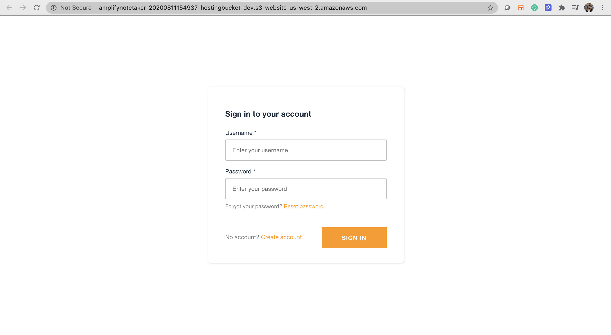
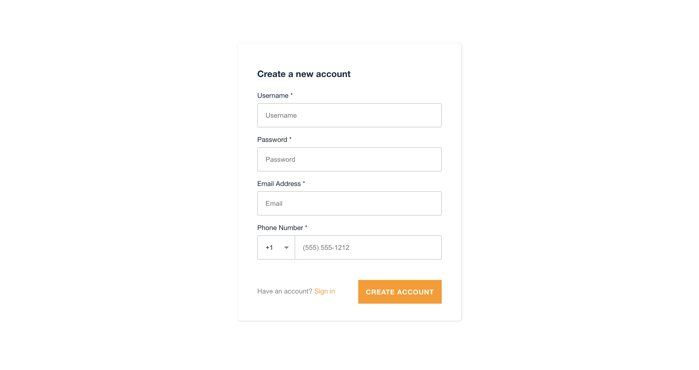
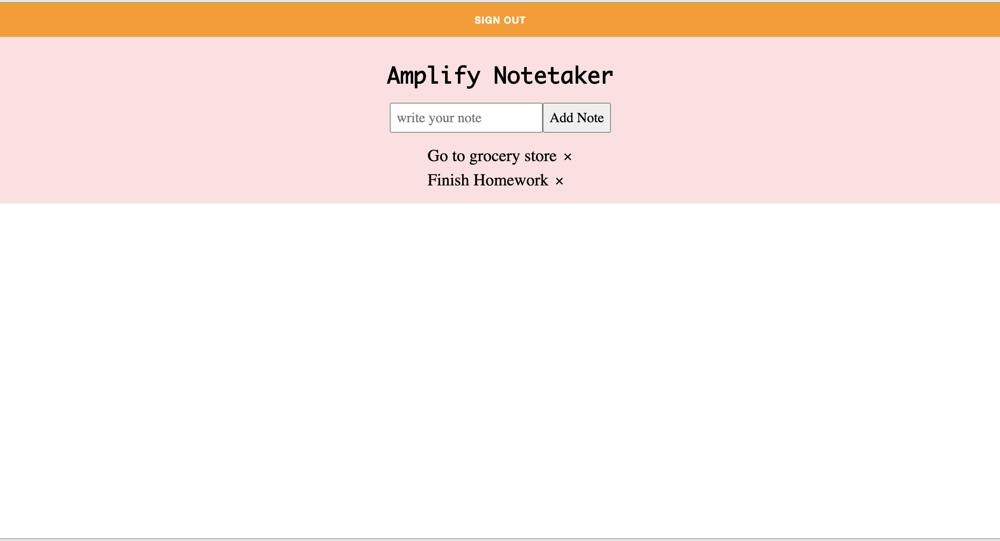

This project is a Real-Time Notetaker App with full CRUD functionality,complete Authentication and all written in ~100 lines of JavaScript

## How to run the app
In the project directory, you can run:

### `npm start`

Runs the app in the development mode. 
Open [http://localhost:3000](http://localhost:3000) to view it in the browser.

The page will reload if you make edits. 

The application will first ask user to Sign In and if no username password, user will need to Sign Up first. 

Each user will be able to see all the posts specify to their accont. 

Each user can apply CRUD apporation on each note. 

### Screenshots

### Deployment

Hosting endpoint: http://amplifynotetaker-20200811154937-hostingbucket-dev.s3-website-us-west-2.amazonaws.com
